# VenturePulse 🚀

**AI-Powered Product Viability Analysis Tool**

Transform your product ideas into comprehensive viability reports using advanced AI analysis. VenturePulse provides strategic insights across market opportunity, technical feasibility, competitive positioning, and business viability.

---

## ✨ Features

- **🤖 Multi-LLM Support**: Choose from 8 leading AI providers (Anthropic Claude, OpenAI GPT, Google Gemini, xAI Grok, and more)
- **📊 Comprehensive Analysis**: 9-tab interactive HTML reports with executive summaries, market analysis, and actionable insights
- **📁 Document Upload**: Supports .txt, .md, .pdf, and .docx files - no conversion needed
- **🎨 Custom Prompts**: Create and manage analysis prompts tailored to your needs
- **📈 Analysis History**: Save, view, and compare multiple analyses
- **🔒 100% Local**: Runs on your machine - your data never leaves your control
- **🐳 Docker-Based**: One-command setup with zero configuration headaches

---

## 🚀 Quick Start (< 5 minutes)

### Prerequisites

- **Docker Desktop** installed ([Download](https://www.docker.com/products/docker-desktop/))
- **API Key** from your chosen LLM provider

### Installation

```bash
# 1. Clone the repository
git clone https://github.com/knightsri/VenturePulse.git
cd VenturePulse

# 2. Configure your API key
cp .env.example .env
nano .env  # or use any text editor

# Edit .env and set:
# API_KEY=your-actual-api-key-here
# MODEL_PROVIDER=openrouter  # or anthropic, openai, google, etc.
# DEFAULT_MODEL=anthropic/claude-sonnet-4.5

# 3. Start VenturePulse
./start.sh          # Linux/Mac
# or
start.bat           # Windows

# 4. Open your browser
# http://localhost:8888
```

**That's it!** 🎉

---

## 🎯 How to Use

### 1. **Prepare Your Project Description**

Write a brief description of your product idea, or upload a document (.txt, .md, .pdf, .docx) containing:

- Problem you're solving
- Target audience
- Proposed solution
- Key features
- Business model (if known)

### 2. **Select Your AI Model**

Choose from 8 providers:

- **Anthropic Claude** - Best for nuanced analysis and reasoning
- **OpenAI GPT** - Versatile and well-rounded
- **OpenRouter** - Access multiple models with one API key
- **Google Gemini** - Great for technical analysis
- **xAI Grok** - Latest from X.AI
- **DeepSeek** - Cost-effective reasoning
- **Mistral AI** - European AI powerhouse
- **Groq** - Ultra-fast inference

💡 **Tip**: Model selection is per-session only. To change defaults permanently, edit `.env` file.

### 3. **Choose an Analysis Prompt**

Select from pre-built prompts or create your own:

- **Default Prompt**: Comprehensive 9-tab analysis
- **Custom Prompts**: Add your own to `workspace/prompts/`

### 4. **Run Analysis**

Click **"🔬 Run Analysis"** at the top of the page.

Analysis typically takes 1-2 minutes depending on:

- Model speed (Claude Haiku is fastest, Opus is most thorough)
- Prompt complexity
- Project description length

### 5. **Review Your Report**

Your analysis will appear in the **History** tab with:

- Interactive HTML report
- Tabbed navigation
- Professional visualizations
- Downloadable file

---

## 📂 Project Structure

```
venturepulse/
├── server.js              # Express backend with LLM integration
├── package.json           # Node.js dependencies
├── public/                # Frontend files (auto-mounted)
│   ├── index.html        # Main UI
│   ├── style.css         # Styling
│   └── app.js            # Client-side JavaScript
├── workspace/            # Your data (persistent storage)
│   ├── config/
│   │   └── settings.json # Provider configurations
│   ├── prompts/          # Analysis prompt templates
│   │   └── *.md         # Add your custom prompts here
│   ├── analysis/         # Generated HTML reports
│   └── uploads/          # Uploaded documents
├── Dockerfile
├── docker-compose.yml
└── .env                  # Your API keys (not in git)
```

---

## 🔧 Configuration

### Environment Variables (`.env`)

```bash
# Required
API_KEY=your-api-key-here
MODEL_PROVIDER=openrouter
DEFAULT_MODEL=anthropic/claude-sonnet-4.5

# Optional
PORT=8888
MAX_FILE_SIZE=10485760  # 10MB in bytes
NODE_ENV=production
```

### Supported Providers

| Provider | Get API Key | Best For |
|----------|-------------|----------|
| **Anthropic** | [console.anthropic.com](https://console.anthropic.com/) | Reasoning, analysis, coding |
| **OpenAI** | [platform.openai.com](https://platform.openai.com/api-keys) | General purpose, creative tasks |
| **OpenRouter** | [openrouter.ai/keys](https://openrouter.ai/keys) | Access all models with one key |
| **Google** | [aistudio.google.com](https://aistudio.google.com/app/apikey) | Technical analysis, multimodal |
| **xAI** | [console.x.ai](https://console.x.ai/) | Latest Grok models |
| **DeepSeek** | [platform.deepseek.com](https://platform.deepseek.com/api_keys) | Cost-effective reasoning |
| **Mistral** | [console.mistral.ai](https://console.mistral.ai/) | European compliance needs |
| **Groq** | [console.groq.com](https://console.groq.com/keys) | Ultra-fast inference |

💡 **Recommended for beginners**: Start with **OpenRouter** - one API key gives you access to all models!

---

## 💡 Usage Tips

### Getting the Best Analysis

1. **Be Specific**: The more detail you provide, the better the analysis
2. **Include Context**: Market size, competitors, your background
3. **Try Multiple Models**: Run the same idea through different models for diverse perspectives
4. **Compare Results**: Each model has different strengths - Claude excels at reasoning, GPT at creativity

### Power User Features

**Multi-Model Comparison**

- Change the model and click "Run Analysis" again
- Multiple analyses run in parallel
- Compare outputs side-by-side in History tab

**Custom Prompts**

```bash
# Add your own analysis templates
cat > workspace/prompts/my-saas-analysis.md << 'EOF'
# SaaS-Specific Analysis Prompt
Analyze this SaaS product idea focusing on:
- ARR projections
- CAC/LTV ratios
- Churn reduction strategies
...
EOF
```

**Session-Based Model Selection**

- UI model selection applies to current session only
- Next session resets to `.env` defaults
- This keeps configuration simple and predictable

---

## 🐛 Troubleshooting

### "API_KEY not configured"

**Solution**: Edit `.env` file and add your API key, then restart:

```bash
docker-compose restart
```

### "Upload failed: File too large"

**Solution**: Increase file size limit in `.env`:

```bash
MAX_FILE_SIZE=20971520  # 20MB
```

### "Analysis failed: aborted"

**Cause**: Timeout or API rate limit
**Solution**:

- Try a faster model (Haiku instead of Opus)
- Check your API key has sufficient credits
- Verify network connection

### Port 8888 already in use

**Solution**: Change port in `.env`:

```bash
PORT=9999
```

Then restart and access at `http://localhost:9999`

### Analysis returns markdown instead of HTML

**Solution**: Update your prompt with strict HTML-only output requirements (see `workspace/prompts/` for examples)

### Docker build errors

**Solution**: Clean rebuild

```bash
docker-compose down
docker-compose build --no-cache
docker-compose up
```

---

## 🔒 Privacy & Security

- **100% Local Execution**: Runs entirely on your machine
- **No Data Collection**: Your project ideas never go to us
- **API Key Security**: Stored locally in `.env` (never committed to git)
- **Workspace Isolation**: All data in `workspace/` directory

**What gets sent to LLM providers:**

- Your project description
- The analysis prompt you selected
- Nothing else!

---

## 🛠️ Development

### Running Without Docker

```bash
# Install dependencies
npm install

# Set environment variables
export API_KEY=your-key
export MODEL_PROVIDER=openrouter

# Start server
npm start

# Access at http://localhost:8888
```

### Tech Stack

- **Backend**: Node.js + Express
- **Frontend**: Vanilla JavaScript (no frameworks!)
- **Containerization**: Docker + Docker Compose
- **File Processing**: pdf-parse, mammoth, marked
- **LLM Integration**: Axios with provider-specific adapters

### Architecture

```mermaid
graph TB
    Browser[🌐 Browser<br/>Vanilla JavaScript]
    Server[⚙️ Express Server<br/>Node.js + Docker]
    Workspace[📁 Workspace Volume<br/>/workspace]
    Prompts[📝 prompts/]
    Analysis[📊 analysis/]
    Uploads[📤 uploads/]
    Config[⚙️ config/]
    
    LLM_APIs[🤖 LLM APIs]
    Anthropic[Anthropic Claude]
    OpenAI[OpenAI GPT]
    OpenRouter[OpenRouter]
    Google[Google Gemini]
    Others[xAI, DeepSeek,<br/>Mistral, Groq]
    
    Browser -->|HTTP/JSON| Server
    Server -->|Read/Write| Workspace
    Workspace --> Prompts
    Workspace --> Analysis
    Workspace --> Uploads
    Workspace --> Config
    
    Server -->|API Calls| LLM_APIs
    LLM_APIs --> Anthropic
    LLM_APIs --> OpenAI
    LLM_APIs --> OpenRouter
    LLM_APIs --> Google
    LLM_APIs --> Others
    
    style Browser fill:#667eea,stroke:#333,stroke-width:2px,color:#fff
    style Server fill:#764ba2,stroke:#333,stroke-width:2px,color:#fff
    style Workspace fill:#48bb78,stroke:#333,stroke-width:2px,color:#fff
    style LLM_APIs fill:#ed8936,stroke:#333,stroke-width:2px,color:#fff
```



---

## 📝 Creating Custom Prompts

Prompts are markdown files in `workspace/prompts/`. Create your own:

```markdown
# My Custom Analysis Prompt

You are analyzing a [INDUSTRY] product idea.

Focus on:
1. Specific metric X
2. Regulatory compliance for Y
3. Market timing for Z

## Output Requirements
Generate an HTML report with these tabs:
- Executive Summary
- [Your custom sections]
...

IMPORTANT: Output ONLY HTML. No markdown code blocks.
Start with <!DOCTYPE html> and end with </html>
```

**Tips for good prompts:**

- Be explicit about HTML-only output (models sometimes wrap in markdown)
- Define clear section structure
- Include scoring criteria
- Specify report length
- Add examples of good/bad outputs

---

## 🤝 Contributing

Contributions welcome! Areas of interest:

- Additional LLM provider integrations
- New analysis prompt templates
- UI/UX improvements
- Documentation enhancements
- Bug fixes

**Process:**

1. Fork the repository
2. Create a feature branch
3. Make your changes
4. Test thoroughly
5. Submit a pull request

---

## 📄 License

MIT License - See [LICENSE](LICENSE) file for details

---

## 🙏 Acknowledgments

Built with:

- [Anthropic Claude](https://www.anthropic.com/) - AI reasoning
- [OpenAI](https://openai.com/) - GPT models
- [OpenRouter](https://openrouter.ai/) - Multi-model access
- [Express.js](https://expressjs.com/) - Web framework
- [Docker](https://www.docker.com/) - Containerization

---

## 📧 Support

- **Issues**: [GitHub Issues](https://github.com/knightsri/VenturePulse/issues)
- **Discussions**: [GitHub Discussions](https://github.com/knightsri/VenturePulse/discussions)
- **Email**: [Your contact if you want to add]

---

## 🗺️ Roadmap

**Completed** ✅

- Multi-LLM provider support
- Document upload (PDF, DOCX, TXT, MD)
- Analysis history management
- Custom prompt system
- Docker containerization

**Coming Soon** 🚧

- Analysis comparison view (side-by-side)
- Prompt editor in UI (no more file editing)
- Export/import workspace backup
- Batch analysis (multiple models at once)
- API rate limit handling
- Cost tracking per analysis

---

**Made with ❤️ by the VenturePulse Team**

*Turn ideas into insights. Ship faster. Build better.*
