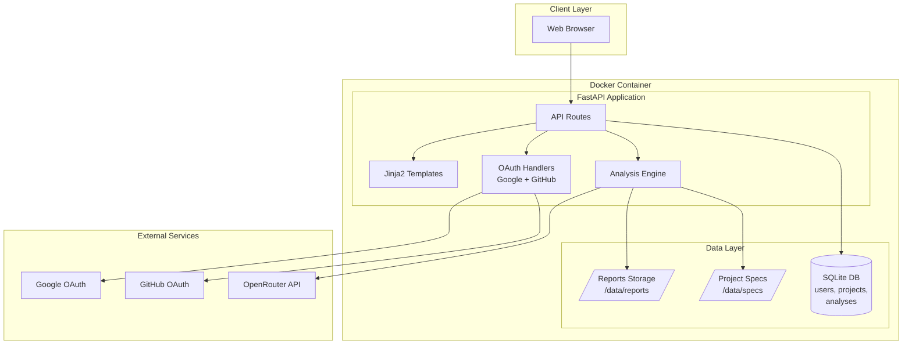
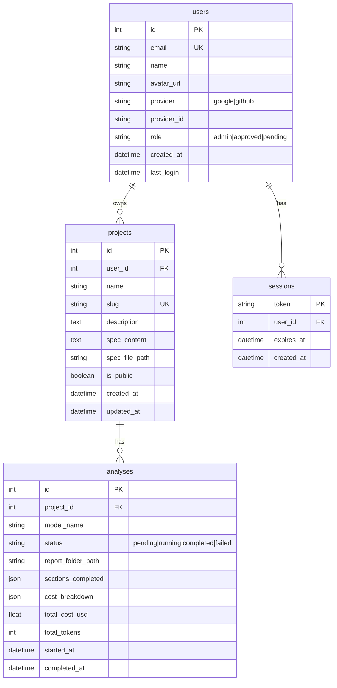

# VenturePulse v2 - Implementation Specification

## Overview

Transform VenturePulse from a single-user Streamlit app to a multi-user FastAPI web application with OAuth authentication, project management, and public/private visibility controls.

**Design Theme:** Bauhaus-inspired (clean geometric shapes, primary colors as accents, strong typography, functional minimalism)

**Live Demo:** https://venturepulse.shalusri.com/  
**Repository:** https://github.com/knightsri/VenturePulse

---

## Architecture Diagram



---

## Database Schema



---

## File Structure

```
venturepulse/
├── docker-compose.yml
├── Dockerfile
├── requirements.txt
├── .env.example
├── README.md
├── CLAUDE.md                    # Updated for v2
│
├── app/
│   ├── __init__.py
│   ├── main.py                  # FastAPI app entry point
│   ├── config.py                # Settings and environment
│   │
│   ├── auth/
│   │   ├── __init__.py
│   │   ├── oauth.py             # Google + GitHub OAuth
│   │   ├── session.py           # Session management
│   │   └── decorators.py        # @require_auth, @require_admin
│   │
│   ├── db/
│   │   ├── __init__.py
│   │   ├── database.py          # SQLite connection
│   │   ├── models.py            # SQLAlchemy models
│   │   └── migrations.py        # Schema setup/migrations
│   │
│   ├── routes/
│   │   ├── __init__.py
│   │   ├── public.py            # Public routes (browse, view)
│   │   ├── auth.py              # Login, callback, logout
│   │   ├── projects.py          # Project CRUD
│   │   ├── analysis.py          # Run analysis, view reports
│   │   └── admin.py             # User management
│   │
│   ├── services/
│   │   ├── __init__.py
│   │   ├── openrouter.py        # API calls (from existing code)
│   │   ├── analysis.py          # Analysis orchestration
│   │   └── report.py            # Report generation
│   │
│   ├── templates/
│   │   ├── base.html            # Bauhaus theme base
│   │   ├── components/
│   │   │   ├── navbar.html
│   │   │   ├── sidebar.html
│   │   │   ├── project_card.html
│   │   │   └── analysis_card.html
│   │   ├── pages/
│   │   │   ├── home.html        # Public landing + featured
│   │   │   ├── login.html       # OAuth buttons
│   │   │   ├── dashboard.html   # User's projects
│   │   │   ├── project_new.html
│   │   │   ├── project_view.html
│   │   │   ├── analysis_run.html
│   │   │   ├── analysis_view.html
│   │   │   ├── browse.html      # Public projects gallery
│   │   │   └── admin.html       # User approval
│   │   └── reports/
│   │       └── section.html     # Report section template
│   │
│   └── static/
│       ├── css/
│       │   └── bauhaus.css      # Main stylesheet
│       ├── js/
│       │   └── app.js           # Minimal interactivity
│       └── img/
│           └── logo.svg
│
├── data/                        # Docker volume mount
│   ├── venturepulse.db          # SQLite database
│   ├── reports/                 # Generated HTML reports
│   │   └── {user_id}/
│   │       └── {project_slug}/
│   │           └── {analysis_id}/
│   │               ├── section01-executive-summary.html
│   │               └── ...
│   └── specs/                   # Uploaded/created specs
│       └── {user_id}/
│           └── {project_slug}.md
│
├── prompts/                     # Existing prompts (unchanged)
│   ├── common-instructions.md
│   └── sections/
│
├── scripts/                     # CLI tools (unchanged)
│   ├── analyze-script.sh
│   └── ...
│
└── sample-specs/                # Demo project specs
    ├── healthcare/
    │   ├── clinical-trial-navigator.md
    │   └── medication-adherence-coach.md
    ├── developer-tools/
    │   ├── api-changelog-tracker.md
    │   └── dependency-drift-monitor.md
    ├── ai-enthusiast/
    │   ├── prompt-library-manager.md
    │   └── model-benchmark-dashboard.md
    ├── consumer/
    │   ├── neighborhood-skill-exchange.md
    │   └── family-recipe-preservation.md
    ├── b2b-saas/
    │   ├── vendor-risk-scorecard.md
    │   └── meeting-cost-calculator.md
    └── retail/
        ├── small-batch-inventory.md
        └── local-loyalty-coalition.md
```

---

## Implementation Tasks

### Phase 1: Foundation (Core Setup)

#### Task 1.1: Project Scaffolding
```yaml
files_to_create:
  - app/__init__.py
  - app/main.py
  - app/config.py
  - requirements.txt
  - Dockerfile
  - docker-compose.yml
  - .env.example

requirements:
  - fastapi>=0.109.0
  - uvicorn[standard]>=0.27.0
  - jinja2>=3.1.0
  - python-multipart>=0.0.6
  - httpx>=0.26.0
  - authlib>=1.3.0
  - itsdangerous>=2.1.0
  - sqlalchemy>=2.0.0
  - aiosqlite>=0.19.0
  - python-dotenv>=1.0.0

docker_compose:
  services:
    web:
      build: .
      ports: ["${PORT:-8080}:8080"]
      volumes:
        - ./data:/app/data
        - ./prompts:/app/prompts
      env_file: .env
      restart: unless-stopped
```

#### Task 1.2: Database Setup
```yaml
files_to_create:
  - app/db/__init__.py
  - app/db/database.py
  - app/db/models.py
  - app/db/migrations.py

models:
  User:
    - id: Integer, primary_key
    - email: String(255), unique, index
    - name: String(255)
    - avatar_url: String(500), nullable
    - provider: String(20)  # google, github
    - provider_id: String(255)
    - role: String(20), default="pending"  # admin, approved, pending
    - created_at: DateTime, default=utcnow
    - last_login: DateTime, nullable
    
  Project:
    - id: Integer, primary_key
    - user_id: ForeignKey(users.id)
    - name: String(255)
    - slug: String(255), unique, index
    - description: Text, nullable
    - spec_content: Text
    - spec_file_path: String(500)
    - is_public: Boolean, default=False
    - created_at: DateTime
    - updated_at: DateTime
    
  Analysis:
    - id: Integer, primary_key
    - project_id: ForeignKey(projects.id)
    - model_name: String(100)
    - status: String(20)  # pending, running, completed, failed
    - report_folder_path: String(500)
    - sections_completed: JSON
    - cost_breakdown: JSON
    - total_cost_usd: Float
    - total_tokens: Integer
    - started_at: DateTime
    - completed_at: DateTime, nullable
    
  Session:
    - token: String(64), primary_key
    - user_id: ForeignKey(users.id)
    - expires_at: DateTime
    - created_at: DateTime

auto_setup:
  - On first startup, create tables if not exist
  - First user to register becomes admin automatically
```

#### Task 1.3: Bauhaus Theme CSS
```yaml
file: app/static/css/bauhaus.css

design_principles:
  - Primary colors: Red (#E53935), Blue (#1E88E5), Yellow (#FDD835), Black (#212121)
  - Background: Off-white (#FAFAFA)
  - Typography: Inter or similar geometric sans-serif
  - Grid-based layouts with strong vertical/horizontal lines
  - Geometric shapes for decorative elements
  - No gradients, minimal shadows
  - Bold section dividers

components:
  navbar:
    - Black background, white text
    - Logo with geometric shape
    - Clean horizontal links
    
  cards:
    - White background, thin black border
    - Colored accent bar on left (by category)
    - Bold title, light description
    
  buttons:
    - Primary: Red background, white text
    - Secondary: Black outline, black text
    - Disabled: Gray, no interaction
    
  forms:
    - Black borders, no rounded corners
    - Yellow highlight on focus
    - Clear labels above inputs
    
  status_badges:
    - pending: Yellow
    - running: Blue
    - completed: Green (using black + checkmark)
    - failed: Red
```

---

### Phase 2: Authentication

#### Task 2.1: OAuth Configuration
```yaml
files_to_create:
  - app/auth/__init__.py
  - app/auth/oauth.py
  - app/auth/session.py
  - app/auth/decorators.py

env_variables:
  GOOGLE_CLIENT_ID: ""
  GOOGLE_CLIENT_SECRET: ""
  GITHUB_CLIENT_ID: ""
  GITHUB_CLIENT_SECRET: ""
  SECRET_KEY: "generate-secure-random-key"
  SESSION_EXPIRE_HOURS: 168  # 7 days

oauth_setup:
  google:
    authorize_url: https://accounts.google.com/o/oauth2/v2/auth
    token_url: https://oauth2.googleapis.com/token
    userinfo_url: https://www.googleapis.com/oauth2/v3/userinfo
    scopes: [openid, email, profile]
    
  github:
    authorize_url: https://github.com/login/oauth/authorize
    token_url: https://github.com/login/oauth/access_token
    userinfo_url: https://api.github.com/user
    scopes: [read:user, user:email]
```

#### Task 2.2: Auth Routes
```yaml
file: app/routes/auth.py

endpoints:
  GET /login:
    - Display login page with Google/GitHub buttons
    - If DEV_MODE=true, show "Dev Login" button
    
  GET /auth/google:
    - Redirect to Google OAuth
    
  GET /auth/google/callback:
    - Handle OAuth callback
    - Create/update user in DB
    - Create session
    - Redirect to dashboard
    
  GET /auth/github:
    - Redirect to GitHub OAuth
    
  GET /auth/github/callback:
    - Handle OAuth callback
    - Create/update user in DB
    - Create session
    - Redirect to dashboard
    
  GET /auth/dev-login:
    - Only if DEV_MODE=true
    - Create test user, create session
    - Redirect to dashboard
    
  POST /logout:
    - Delete session
    - Redirect to home

first_user_logic:
  - Check if any users exist in DB
  - If no users, set role="admin" for first registrant
  - Otherwise, set role="pending"
```

#### Task 2.3: Auth Decorators
```yaml
file: app/auth/decorators.py

decorators:
  @require_auth:
    - Check for valid session cookie
    - If no session, redirect to /login
    - Inject user object into request.state.user
    
  @require_approved:
    - Includes @require_auth
    - Check user.role in ["admin", "approved"]
    - If pending, redirect to /pending-approval
    
  @require_admin:
    - Includes @require_auth
    - Check user.role == "admin"
    - If not admin, return 403
```

---

### Phase 3: Core Routes & Templates

#### Task 3.1: Public Routes
```yaml
file: app/routes/public.py

endpoints:
  GET /:
    - Home page
    - Show featured public projects
    - Login/Register CTA if not authenticated
    - Quick stats (total analyses, models used)
    
  GET /browse:
    - Gallery of all public projects
    - Filter by domain/category
    - Search by name
    - Sort by recent, popular
    
  GET /project/{slug}:
    - View public project details
    - List of analyses for this project
    - If owner or admin, show edit/delete options
    
  GET /analysis/{id}:
    - View analysis report
    - Section navigation
    - Cost/token breakdown
    - Model info
```

#### Task 3.2: Project Management Routes
```yaml
file: app/routes/projects.py

endpoints:
  GET /dashboard:
    - @require_auth
    - List user's projects (public + private)
    - Quick actions: new project, run analysis
    
  GET /project/new:
    - @require_approved
    - Form: name, description, spec (upload or paste)
    - Public/private toggle
    
  POST /project/new:
    - @require_approved
    - Validate input
    - Generate slug from name
    - Save spec to file
    - Create DB record
    - Redirect to project view
    
  GET /project/{slug}/edit:
    - @require_approved
    - Owner or admin only
    - Edit form with current values
    
  POST /project/{slug}/edit:
    - @require_approved
    - Update project
    
  POST /project/{slug}/delete:
    - @require_approved
    - Owner or admin only
    - Soft delete or hard delete
    - Delete associated files
```

#### Task 3.3: Analysis Routes
```yaml
file: app/routes/analysis.py

endpoints:
  GET /project/{slug}/analyze:
    - @require_approved
    - Show analysis configuration form
    - Model selector (from existing POPULAR_MODELS)
    - Section selection (Quick/Full/Custom)
    
  POST /project/{slug}/analyze:
    - @require_approved
    - Create analysis record (status=pending)
    - Start background task
    - Redirect to analysis progress page
    
  GET /analysis/{id}/status:
    - Return JSON with current status
    - For polling during analysis
    
  GET /analysis/{id}:
    - View completed analysis
    - Section navigation
    - Report content
```

#### Task 3.4: Admin Routes
```yaml
file: app/routes/admin.py

endpoints:
  GET /admin:
    - @require_admin
    - List pending users (approval queue)
    - List all users with roles
    - System stats
    
  POST /admin/user/{id}/approve:
    - @require_admin
    - Set user.role = "approved"
    
  POST /admin/user/{id}/reject:
    - @require_admin
    - Delete user or set role="rejected"
    
  POST /admin/user/{id}/revoke:
    - @require_admin
    - Set approved user back to pending
```

---

### Phase 4: Analysis Engine

#### Task 4.1: Analysis Service
```yaml
file: app/services/analysis.py

functions:
  run_analysis(project_id, model_name, sections):
    - Load project spec from file
    - Create report folder: data/reports/{user_id}/{project_slug}/{analysis_id}/
    - For each section:
      - Load prompt from prompts/sections/
      - Call OpenRouter API
      - Save HTML to report folder
      - Update analysis.sections_completed
      - Track cost and tokens
    - Update analysis status and totals
    - Return analysis_id

  get_analysis_progress(analysis_id):
    - Return current status, completed sections, errors
    
reuse_from_existing:
  - Port call_openrouter() from venturepulse.py
  - Port generate_provenance() for cost tracking
  - Keep same prompt structure
```

#### Task 4.2: Background Task Handling
```yaml
approach: Simple threading (no Celery needed for this scale)

implementation:
  - Use concurrent.futures.ThreadPoolExecutor
  - Store executor reference in app.state
  - Submit analysis as background task
  - Poll /analysis/{id}/status for updates
  
alternative_for_scale:
  - If needed later, add Redis + Celery
  - For now, simple threading is sufficient
```

---

### Phase 5: Templates

#### Task 5.1: Base Template
```yaml
file: app/templates/base.html

structure:
  - DOCTYPE, html, head
  - Meta tags, title
  - Link to bauhaus.css
  - Navbar include
  - Flash messages area
  - Main content block
  - Footer with repo/demo links
  - Minimal JS include

navbar_items:
  always:
    - Logo -> /
    - Browse -> /browse
  authenticated:
    - Dashboard -> /dashboard
    - Logout -> /logout
  admin:
    - Admin -> /admin
  unauthenticated:
    - Login -> /login
```

#### Task 5.2: Key Page Templates
```yaml
pages:
  home.html:
    - Hero section with tagline
    - Featured public projects (3-4 cards)
    - How it works (3 steps)
    - CTA to login/browse
    
  login.html:
    - Centered card
    - Google OAuth button (red accent)
    - GitHub OAuth button (black)
    - "First user becomes admin" note
    
  dashboard.html:
    - Header with "My Projects"
    - New Project button (if approved)
    - Project cards grid
    - Empty state if no projects
    
  project_view.html:
    - Project header (name, description, visibility badge)
    - Spec preview (collapsible)
    - Analyses list with status badges
    - "Run New Analysis" button (if approved)
    
  analysis_run.html:
    - Model selector dropdown
    - Section selection (Quick/Full/Custom checkboxes)
    - Cost estimate (if possible)
    - Start button
    
  analysis_view.html:
    - Two-column layout
    - Left: Section navigation
    - Right: Report content iframe or embedded HTML
    - Top: Model info, cost, duration
    
  admin.html:
    - Pending approvals section (prominent)
    - All users table with role badges
    - Approve/Reject/Revoke buttons
```

---

### Phase 6: Polish & Deployment

#### Task 6.1: Error Handling
```yaml
implement:
  - Custom 404 page
  - Custom 500 page
  - Flash messages for user feedback
  - Form validation errors displayed inline
  - API error handling for OpenRouter failures
```

#### Task 6.2: Security
```yaml
implement:
  - CSRF protection on forms
  - Session cookie security (httponly, secure, samesite)
  - Input sanitization
  - SQL injection prevention (SQLAlchemy handles this)
  - Rate limiting on analysis endpoint
```

#### Task 6.3: Docker Production Config
```yaml
dockerfile:
  - Python 3.11-slim base
  - Non-root user
  - Health check endpoint
  - Proper signal handling

docker_compose_prod:
  - Resource limits
  - Restart policy
  - Volume for data persistence
  - Environment from .env
```

#### Task 6.4: Sample Data Seeding
```yaml
script: scripts/seed-demo-data.py

actions:
  - Create demo user (optional)
  - Load sample specs from sample-specs/
  - Create projects marked as public
  - Run analyses on sample projects (optional, costs money)
```

---

## Environment Variables Summary

```bash
# Required
OPENROUTER_API_KEY=sk-or-v1-xxx

# OAuth (required for production)
GOOGLE_CLIENT_ID=xxx.apps.googleusercontent.com
GOOGLE_CLIENT_SECRET=xxx
GITHUB_CLIENT_ID=xxx
GITHUB_CLIENT_SECRET=xxx

# App Config
SECRET_KEY=generate-64-char-random-string
PORT=8080
BASE_URL=https://venturepulse.shalusri.com

# Optional
DEV_MODE=false          # Set true for local dev without OAuth
DEFAULT_MODEL=anthropic/claude-sonnet-4
MAX_PARALLEL_SECTIONS=10
SESSION_EXPIRE_HOURS=168
```

---

## Migration Path from v1

1. **Keep CLI unchanged** - scripts/ folder works as-is
2. **Keep prompts unchanged** - prompts/ folder works as-is
3. **Deprecate Streamlit** - app/venturepulse.py becomes legacy
4. **New FastAPI app** - parallel development, same repo
5. **Data migration** - optional script to import existing reports

---

## Testing Checklist

```markdown
### Auth Flow
- [ ] Google OAuth login works
- [ ] GitHub OAuth login works
- [ ] First user becomes admin
- [ ] Subsequent users are pending
- [ ] Admin can approve users
- [ ] Approved users can create projects
- [ ] Pending users cannot create projects
- [ ] Logout clears session
- [ ] DEV_MODE bypass works

### Project Management
- [ ] Create project with pasted spec
- [ ] Create project with uploaded file
- [ ] Edit project
- [ ] Delete project
- [ ] Toggle public/private
- [ ] Public projects visible to all
- [ ] Private projects hidden from others

### Analysis
- [ ] Run analysis with Quick sections
- [ ] Run analysis with Full sections
- [ ] Run analysis with Custom sections
- [ ] Progress updates during analysis
- [ ] View completed analysis
- [ ] Cost tracking accurate
- [ ] Error handling for API failures

### Public Access
- [ ] Home page loads without login
- [ ] Browse shows only public projects
- [ ] Can view public project details
- [ ] Can view public analysis reports
- [ ] Cannot run analysis without login
```

---

## Estimated Effort

| Phase | Tasks | Effort |
|-------|-------|--------|
| Phase 1: Foundation | 3 | 4-6 hours |
| Phase 2: Authentication | 3 | 4-6 hours |
| Phase 3: Core Routes | 4 | 6-8 hours |
| Phase 4: Analysis Engine | 2 | 3-4 hours |
| Phase 5: Templates | 2 | 4-6 hours |
| Phase 6: Polish | 4 | 4-6 hours |
| **Total** | **18** | **25-36 hours** |

---

## Next Steps

1. Create sample business specs (12 specs across 6 domains)
2. Begin Phase 1 implementation
3. Set up OAuth credentials in Google Cloud Console and GitHub
4. Deploy to test environment